# Sign Language Detection

Welcome to the Sign Language Detection Project! This computer vision initiative leverages the *YOLOv5s* model and is built using Python modular programming. The project's goal is to create an interface that aids in understanding the messages conveyed by individuals with speech impairments.

## Table of contents
- [Overview](#overview)
- [Project Structure](#project-structure)
- [Installation](#installation)
- [Usage](#usage)
- [Project Explanation](#project-explanation)
- [Glimpses](#glimpses)
- [Contributing](#contributing)
- [Contact](#contact)

## Overview
The Sign Language Detection project leverages computer vision technology, utilizing the YOLOv5s model to interpret and predict sign language used by individuals with speech impairments. The model has been trained with a dataset comprising 3,500 images, divided into seven classes: *Hello*, *Namaste*, *Yes*, *No*, *I Love You*, *Please*, and *Thank You*. Each class originally contained 500 images, and through data augmentation, the total number of images increased to 8,400. The project is organized in a modular structure, ensuring it is easy to understand, maintain, and extend.

## Project Structure
The repository contains the following folders and files:
1. **data**: Contains the file used for prediction.
   - `.gitkeep`: An empty file to ensure the directory is tracked by Git.
2. **src**: Contains the core code organized into various modules and components.
   - `__init__.py`: Initializes the `src` module.
   - **components**: Contains the components responsible for different stages of the pipeline.
     - `__init__.py`: Initializes the `components` submodule.
     - `data_ingestion.py`: Handles the process of gathering and preparing data.
     - `data_validation.py`: Ensures that the required file are present in the feature_store folder.
     - `model_trainer.py`: Manages the training of the YOLOv5s model.
     - `model_pusher.py`: Handles the deployment of the trained model.
   - **configuration**: Contains configuration-related files.
     - `__init__.py`: Initializes the `configuration` submodule.
     - `s3_operations.py`: Manages interactions with Amazon S3 storage.
   - **constant**: Contains constants used throughout the project.
     - `__init__.py`: Initializes the `constant` submodule.
     - **training_pipeline**: Contains constants specific to the training pipeline.
       - `__init__.py`: Initializes the `training_pipeline` submodule within `constant`.
     - `application.py`: Contains application-level constants.
   - **entity**: Defines data structures for configuration and artifacts.
     - `__init__.py`: Initializes the `entity` submodule.
     - `artifacts_entity.py`: Defines data structures for artifacts produced by the pipeline.
     - `config_entity.py`: Defines data structures for configuration settings.
   - **pipeline**: Manages the execution of different pipelines.
     - `__init__.py`: Initializes the `pipeline` submodule.
     - `training_pipeline.py`: Manages the execution of the training pipeline.
   - `exception.py`: Handles exceptions and errors.
   - `logger.py`: Configures and manages logging.
   - `utils.py`: Contains utility functions.
3. **templates**: Contains the HTML files.
   - `index.html`: The HTML template for the user interface.
4. **.dockerignore**: Specifies files and directories to ignore in Docker builds.
5. **app.py**: The main application file.
6. **Dockerfile**: Instructions for building the Docker image.
7. **requirements.txt**: Lists all the dependencies.
8. **setup.py**: Script for setting up the project.
9. **template.py**: Script Used to build the above Project structure.

## Installation
To get a copy of this project up and running on your local machine, follow these steps:

1. **Clone the Repository:**
    ```bash
    git clone https://github.com/SHP50c/Sign_language_Using_object_detection_YOLO_V5.git
    ```

2. **Create and activate a virtual environment:**
    ```bash
    conda create -p venv python=3.8
    ```

3. **Run setup.py**
    ```bash
    python setup.py
    ```

## Usage
To collect your own dataset and train the model using it, you can use the `data_collector.py` script. Run the following command:

  ```bash
  python data_collector.py
  ```

Once the dataset is collected, You need to data annotation. I made useof roboflow for data annotaion followed by data augmentation.
Later follow the steps outlined in the Jupyter notebooks (.ipynb files). I trained my model using a Kaggle notebook due to the lack of a GPU on my local system. If you have a large dataset, I recommend doing the same. Alternatively, you can rent a GPU on Google Colab or use Kaggle's free GPU resources.

If you prefer not to collect and train your own dataset, you can simply run the application using the `app.py` script:

  ```bash
  python app.py
  ```

You can access the application in your browser at `http://0.0.0.0:8080/`. To predict live images or live video, navigate to `http://0.0.0.0:8080/live`.

## Project Explaination
In this Project, we aim to predict 7 signs by individuals with speech impairments. Namely **Hello**, **Namaste**, **Yes**, **No**, **I Love You**, **Please**, and **Thank You**.
- **Kaggle_Sign_language_notebook.ipynb**: This file contains few detail of the dataset and the training of the dataset that please go through it for the insight of the project.this entire project is a mimic of this notebook in modular fashion, with seperate scripts for data ingestion, data validation, model pusher and model trainer.
- you can go through the runtime logs in the `logs` folder for better understanding of the processes.

## Glimpses
Attached below are few of the snapshots taken during anotation proccess in roboflow.
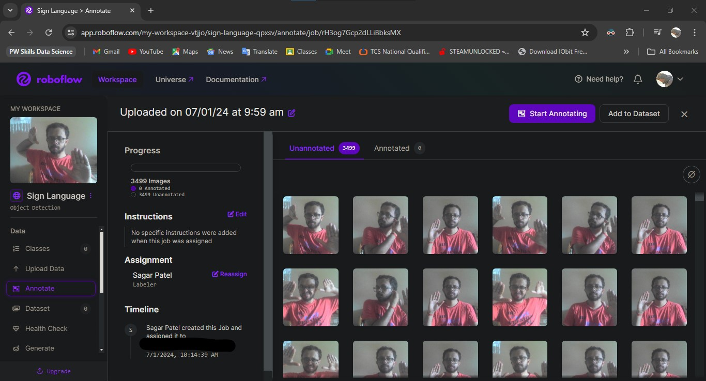
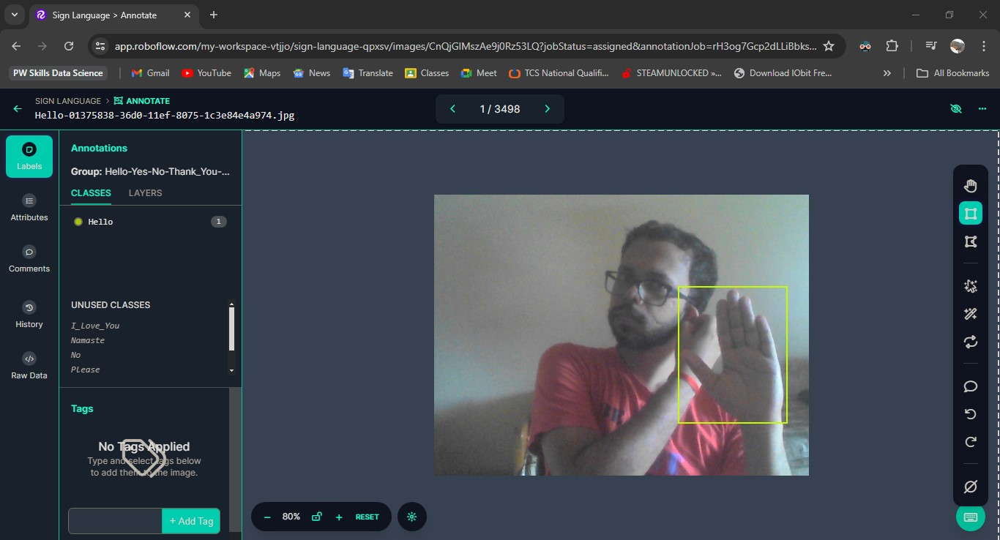
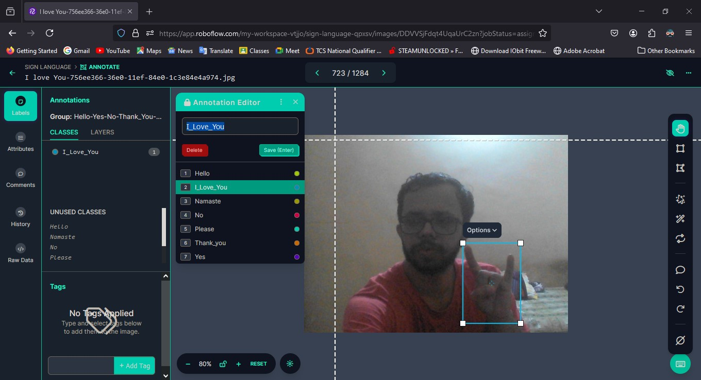
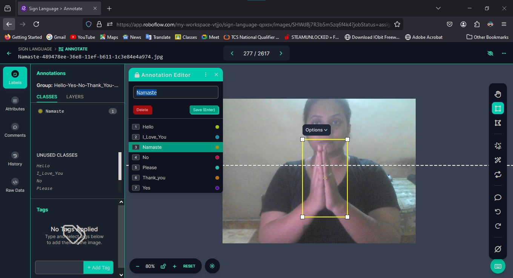
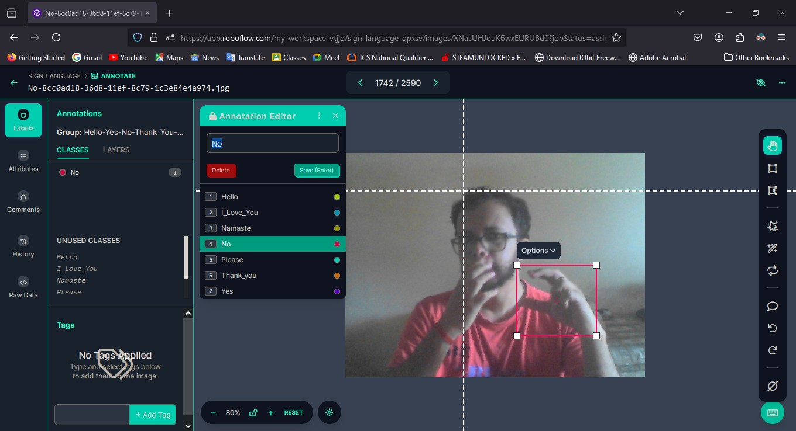
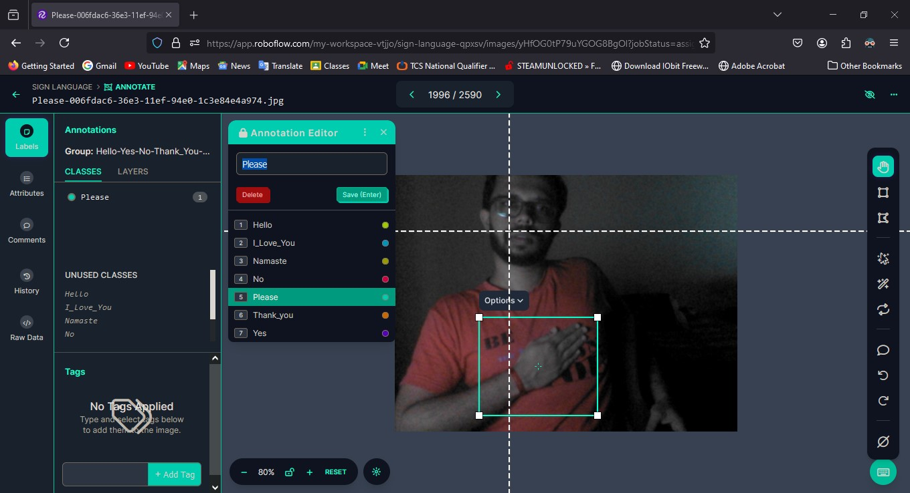
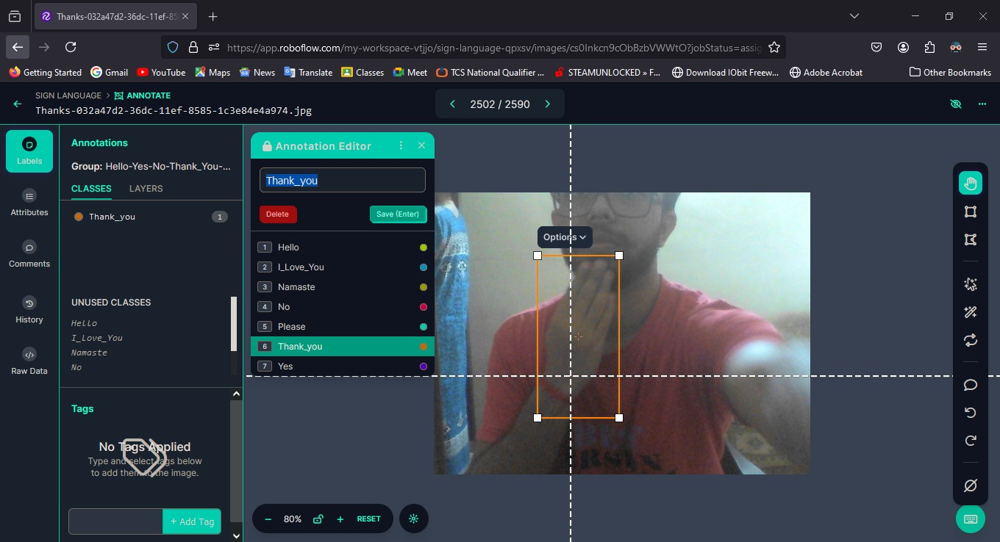
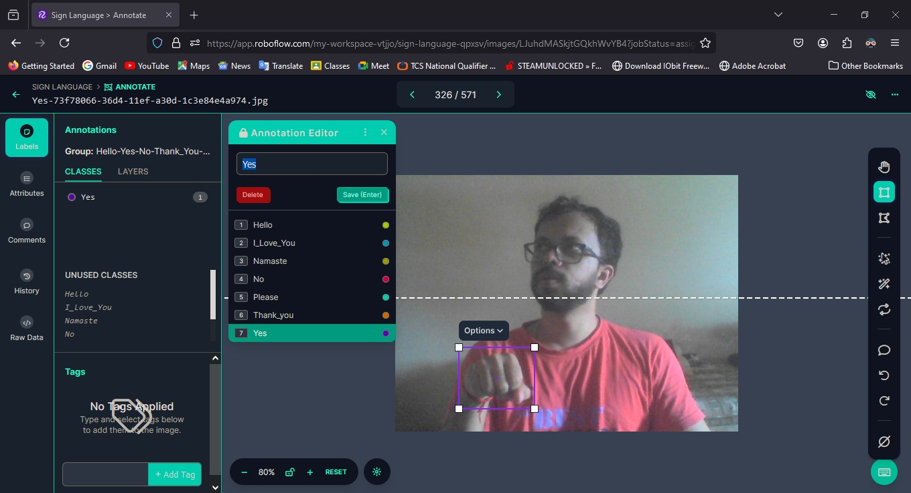

I have also Attached below are few of the predicted images by the model.

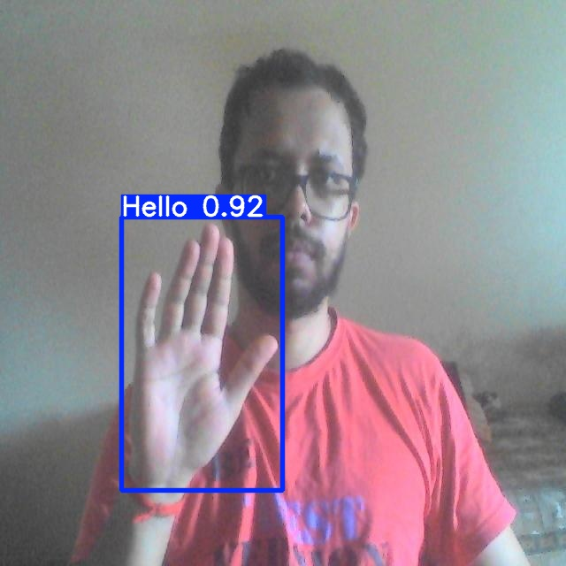
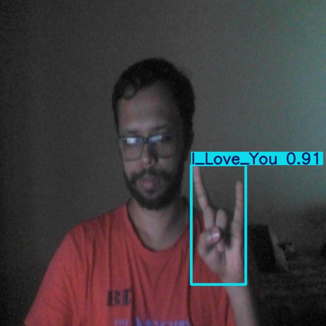
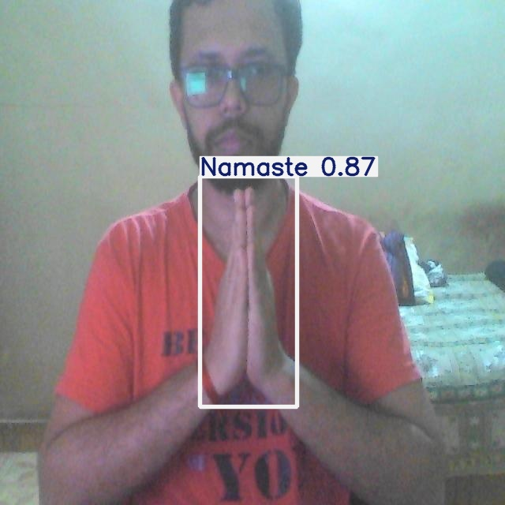
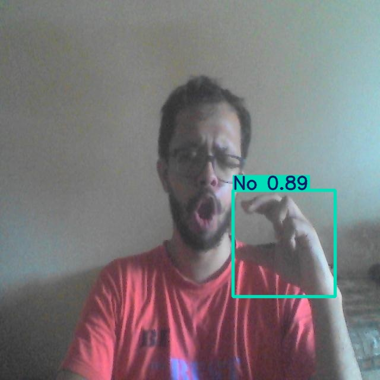
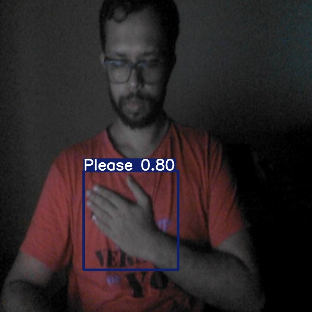
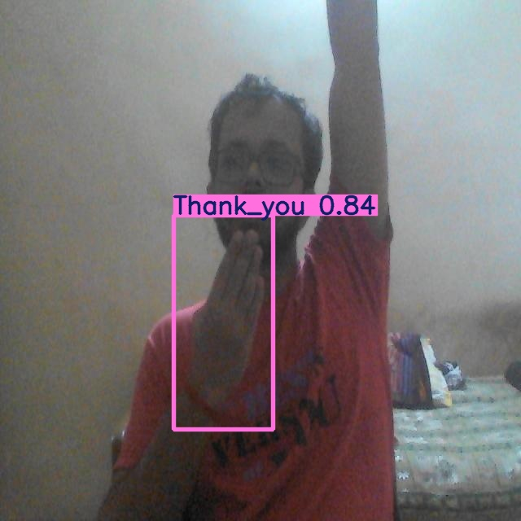
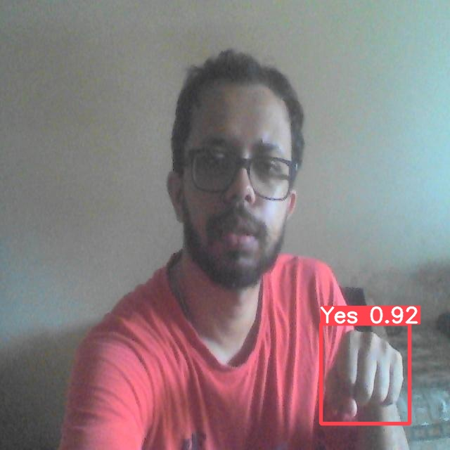

## Contributing
Contributions are welcome! If you'd like to contribute, please fork the repository and use a feature branch. Pull requests are warmly welcome.

1. **Fork the repository**
2. **Create your feature branch** (`git checkout -b feature/AmazingFeature`)
3. **Commit your changes** (`git commit -m 'Add some AmazingFeature'`)
4. **Push to the branch** (`git push origin feature/AmazingFeature`)
5. **Open a Pull Request**

## Contact
If you have any questions or suggestions, feel free to reach out:

- **Email**: sagarpatelsp714@gmail.com
- **GitHub**: [SHP50c](https://github.com/SHP50c)

---

Thank you for visiting the Sign Language Detection project! We hope you find it useful and informative.